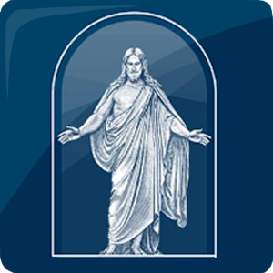

# American Fork 30th Ward Weekly Sacrament Meeting Program

The weekly sacrament meeting program for the American Fork 30th Ward of the Church of Jesus Christ of Latter-day Saints.

## How this works
Every week, an automatically generated meeting program will be downloaded from
[here](https://docs.google.com/spreadsheets/d/1M7p-Jbe0gi29FjwtNnUx-XnaYpd4gxJtB54wahQoRgM/edit#gid=1190727781)
as a PDF and committed to this repository. We do this to provide a static link
for a QR code. In order for the PDF's URL to remain static, last week's program will
always be overwritten by this week's program. However, you can always get a list
of all past programs by looking at this repository's [commit
history](https://github.com/american-fork-30th-ward/weekly-program/commits/main/).

## Resources for future maintainers
- [The auto-formatted program](https://docs.google.com/spreadsheets/d/1M7p-Jbe0gi29FjwtNnUx-XnaYpd4gxJtB54wahQoRgM/edit#gid=1190727781) - This is the spreadsheet that we download the program from. If there are any errors that need correcting, you'll need to fix them, then re-download and commit the PDF here so that it updates for the QR code.
- [The sacrament programming
  dashboard](https://docs.google.com/spreadsheets/d/1nS-4GVVLZk6miwsa8i1RbHoG2I9uzwbAyNmyGY0MPEo/edit#gid=1238603958)
	- This is a google sheet used to orchestrate speakers, music, and
  announcements from various other spreadsheets into one convenient place. Use
  this to verify and edit what goes on the program every week. I've done my best
  to make the dashboard simple to use and hide away the "plumbing" that makes it
  all run, as well as documenting each and every field you may need to know
  about. I've also locked down fields that your average joe shouldn't be able to
  edit to prevent things from getting broken accidentally.

## Design Resources

- [QR Code Monkey](https://www.qrcode-monkey.com/)

## Other Notes
- Primary Color: #0e3961 (Church Blue)

